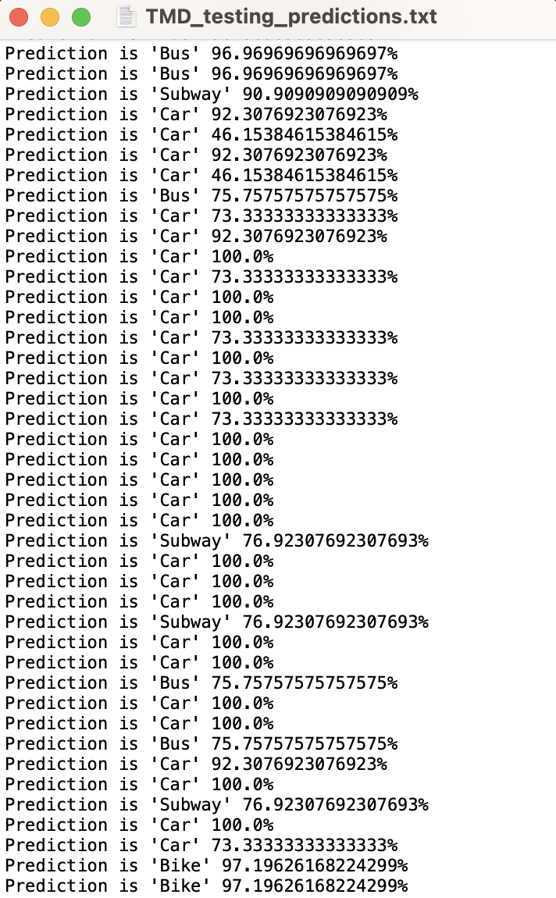

# Transportation-Mode-Detection

A machine learning tool in the form of a decision tree algorithm that is capable of detecting the mode of transportation from the data logs in the [Microsoft Geolife GPS trajectory dataset](https://www.microsoft.com/en-us/research/publication/geolife-gps-trajectory-dataset-user-guide/). 

  
  

# Description/Overview of the project

#### Dataset preparation

For the first iteration of this model, only the 5 main modes of transportation being "Walk", "Car", "Bus", "Bike", and "Subway" were downloaded from the Microsoft dataset. Once these files were downloaded, a new column containing the mode of transportation for that file (found in the labels.txt file in the Microsoft dataset) was added to the end of each file. Each file was then saved as a CSV file inside the "TMD_Datalog" folder. 

In order to create a training dataset for the model, 10 new features are created using the python script "dataset_builder.py". This is done because the features/information inside the datalogged files from the Microsoft dataset do not have much of a distinction from one another since they mostly contain location data (Latitude, Longitude, etc.). Therefore, new features are created so that a clean and relevant dataset is created for the machine learning model. Specifically, the training dataset for the machine learning model contains the following information:

* Distance
* Speed
* Acceleration
* Average speed
* Standard deviation of speed
* Max speed
* 75% percentile of speed
* 50% percentile of speed
* Average accelration
* Standard deviation of acceleration
* Mode of transportation (Target Class)

#### Model training and optimization

A decision tree algorithm was chosen for this project and the Scikit Learn python library is used to train the machine learning model. Lots of important statistics for the ML model are also outputted as the model is being trained so that the effectiveness of the model can be better gauged. These include:

* Testing and training accuracy score
* Testing and training confusion matrices
* Classification report for each mode which includes:
    * F1 Score 
    * Percision Score
    * Recall Score

A separate file is used to optimize the decision tree model so that the accuracy of the model can be improved. 2 specific strategies were used here to improve the model:

* Pre-pruning of the decision tree: Finding the best hyper-parameters to feed the model before the start of the model training
* Post-pruning of the decision tree: Removing and reducing the complexity of the decision tree after an initial tree has been created

Same statistics as the model_training file along with even more graphs are outputted in the model_optimization file. A jupyter notebook (.ipynb) structure was chosen for both of these files to better visualize each step of the machine learning training and optimization process. 

#### Making new detections

Lastly, the final machine learning model is saved as a python pickle file and can be loaded and deployed again to make transportation mode detections. Here, "detections.py" imports the saved machine learning model, and applies the model on a testing dataset where the target classes along with their respective confidence percentages are predicted and saved into a txt file. 

# Getting Started

The flowchart below shows the pipeline of this project. 

Feature_optimization.ipynb is also created as an extra area in which the performance of the model could be improved. Each mode of the dataset for each of the columns of the decision (each feature) is visualized using a histogram graph. Visualizing these graphs can help understand the distribution of every feature in the dataset. Understanding the distribution can help validate if using the features would be beneficial for the model. If one of the features, has somewhat the same distribution for all of the different modes of transportation, then there is not enough of a distinction to differentiate between the different modes of transportation which somewhat suggests that using this feature would not really add any benefits to model and can be potentially removed from the dataset to simplify the model training process. 

# Author
Behrad Haghighi
bhaghigh@uwaterloo.ca